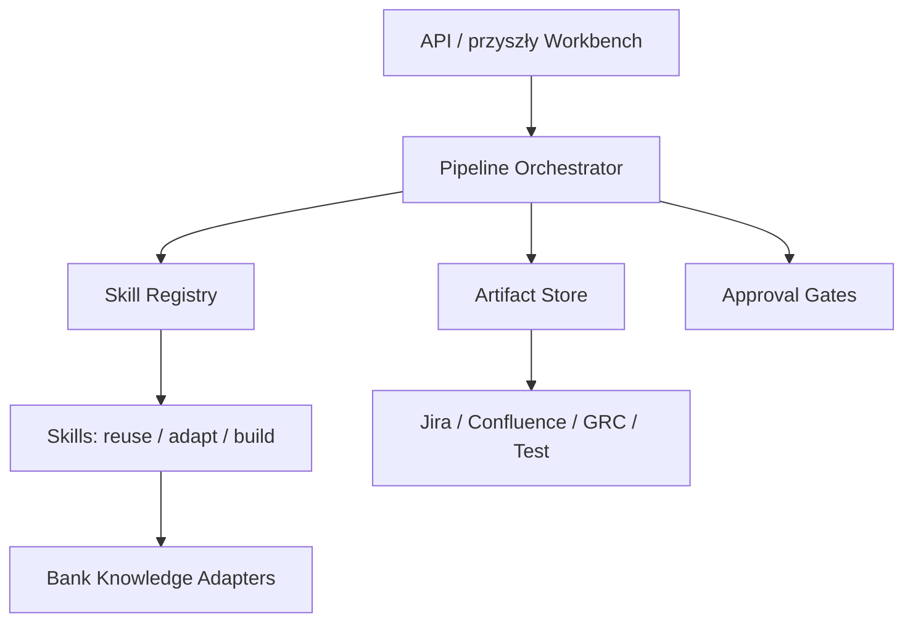

# Architektura rozwiązania

## Zasady

- Requirement jest wersjonowanym obiektem danych, nie fragmentem dokumentu.
- Agent reprezentuje rolę; skill reprezentuje powtarzalną metodę; adapter wykonuje integrację.
- AI proponuje, człowiek zatwierdza. Artefakt staje się źródłem prawdy dopiero po approval gate.
- Każdy wynik zachowuje provenance: źródła, skill i wersję, status oraz pytania otwarte.
- Kroki regulacyjne nie wydają samodzielnej opinii o zgodności.

## Widok logiczny

## Komponenty

| Komponent | Odpowiedzialność | Stan MVP |
|---|---|---|
| Workbench | formularz inicjatywy, wymagań i prezentacja wyników | działa |
| API | uruchomienie i odczyt pipeline | działa in-memory |
| Orchestrator | sekwencja kroków, statusy, gates | działa |
| Skill Registry | routing, wersje, REUSE/ADAPT/BUILD | działa z YAML |
| Artifact Model | initiative, requirement, finding, trace | działa |
| Local Linter | reguły strukturalne i językowe | działa |
| LLM Gateway | generowanie semantyczne | port/zaślepka |
| Knowledge Gateway | RAG na politykach, regulacjach i architekturze | port/zaślepka |
| Graph Store | traceability i impact analysis | port/zaślepka |
| System adapters | Jira, Confluence, GRC, katalog danych, testy | port/zaślepki |

## Pipeline MVP

1. `idea-refinement` — przygotowanie briefu; adaptacja wzorca open source.
2. `requirements-elicitation` — wykrycie braków i pytań blokujących.
3. `requirement-writing` — draft BR; obecnie zaślepka generatywna.
4. `requirement-linting` — deterministyczna kontrola jakości.
5. `regulatory-traceability` — zaślepka wymagająca źródeł i review Compliance.
6. `traceability` — zaślepka grafowa.
7. `human-approval` — wymagany gate przed publikacją.

## Model rozszerzeń

Każdy skill posiada `SKILL.md`, a jego runtime'owy kontrakt znajduje się w `config/skills.yaml`. Implementację dodaje się przez klasę realizującą `SkillExecutor`; integracje przez protokoły w `ports.py`. To pozwala wymienić model, bazę grafową i systemy banku bez zmiany domeny.

## Bezpieczeństwo i governance

- prompt/input/output logging powinien być redagowany z danych osobowych i tajemnic bankowych;
- modele i źródła wiedzy muszą mieć allowlistę oraz wersjonowanie;
- decyzje Compliance, Risk, Architecture i Business Owner są approval gates;
- wymagania i trace muszą mieć historię, autora oraz dowody źródłowe;
- eksport do systemów źródłowych jest oddzielną, autoryzowaną operacją.
